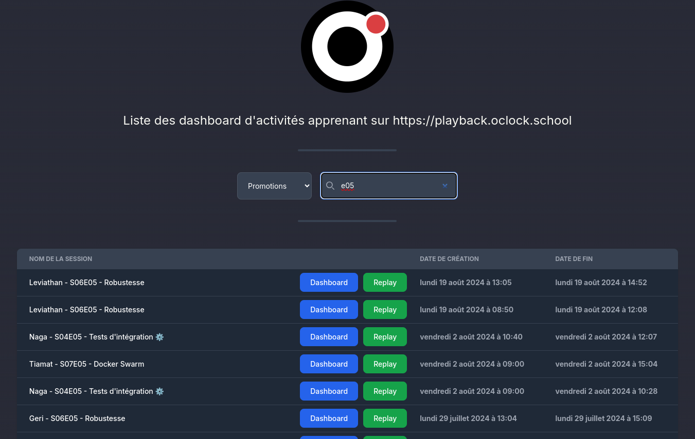

# bbb-session-insights

Open source AGPLv3 software for BigBlueButton session analysis.

## Description

**bbb-session-insights** is a project initially aimed at listing all training sessions for O'clock promotions taking place on BigBlueButton (BBB). It is now open source and available to everyone. This dashboard allows users to easily view and track all current and past training sessions, as well as obtain details on each session:
- Learning dashboard (can be accessed and downloaded after the session has ended)
- Recordings (called Replays)
- Video (*planned*)
- Chat messages (*planned*)



## Setup

### Requirements

- Next.js >= v14
- npm >= v6
- Docker engine with compose support

### Installation

1. Clone the repository :
    ``bash
    git clone https://github.com/O-clock-Dev/bbb-session-insights.git
    cd bbb-session-insights
    ```
2. Generate the NextAuth key :
    ``bash
    openssl rand -base64 32
    ```
3. Setting up an `.env` file
    * Draw your inspiration from `.example.env`.
    * Or the [Configuration](#configuration) section.

### Configuration

#### env file

> NextJS supports [current env files and priorities](https://nextjs.org/docs/pages/building-your-application/configuring/environment-variables)

* Check file [`.example.env`](.example.env)
* OIDC Keycloak configuration
    * `SKIP_KEYCLOAK=true` : avoid OIDC authentication.
    * `KEYCLOAK_CLIENT_ID=“client-id”` : KC OIDC client ID, see [keycloak documentation](https://www.keycloak.org/docs/latest/server_admin/#_identity_broker_oidc).
    * `KEYCLOAK_CLIENT_SECRET=“ secret”` : KC OIDC client secret.
    * `KEYCLOAK_ISSUER=” https://auth.mydomain.io/realms/myrealm ”` : your Keycloak kingdom.
* NextAuth config (see [#options](https://next-auth.js.org/configuration/options))
    * `NEXTAUTH_URL=” http://localhost:3000 ”`: environment variable for your site's canonical URL, supports dynamic base path via `NEXT_PUBLIC_BASE_PATH`.
    * `NEXTAUTH_SECRET=” <output from openssl rand -base64 32> ”`: used to encrypt NextAuth.js JWT, and to hash email verification tokens.
* NextJS
    * `NEXT_PUBLIC_BASE_PATH=” /bsi ”`: dynamic basePath support used to offer reverse proxy support for a single URL or URL path segment.
* Application configuration
    * `LEARNING_DASHBOARD_FOLDER=”/folder/learning-dashboard”`: location of BBB learning dashboard folder.
    * `LEARNING_DASHBOARD_BASEURL=”https://bbb.mydomain.school”`: URL of the BBB server used to host the public BBB session data link.
    * `REPLAYS_FOLDER=”/folder/published/presentation”`: location of the BBB records folder.

#### SSO

* SSO configuration is optional, use `SKIP_KEYCLOAK=true` if you want to avoid using OIDC Keycloak authentication.

#### Local development

> **A dataset is required for local development.

* For the moment, our dataset is private.
    * We will make it public [in the future](https://github.com/O-clock-Dev/bbb-session-insights/issues/16)
    * Download the private [dataset](https://drive.google.com/file/d/1772JIiIe9WbYtItGNp-nyCT4z0i5AZxK/view?usp=sharing)
* Extract it into a `datas` directory.
* Use `NODE_ENV` with `localdev` to use the local dataset.

#### Development using BBB data

* Check `compose.yaml` and `.example.env` and mount the `/var/bigbluebutton` subdirectories in the correct destinations.

### Launching

> The preferred method is **docker**.

* Docker :
    * `docker compose up --build -d`
* npm :
    * `npm run dev`: for development.
    * `npm run build` : to build the application.
    * `npm run start` : starts the built application.

## Usage

* Access your instance according to your `NEXTAUTH_URL` parameter or your reverse proxy configuration and enjoy the list of data from your BBB sessions.